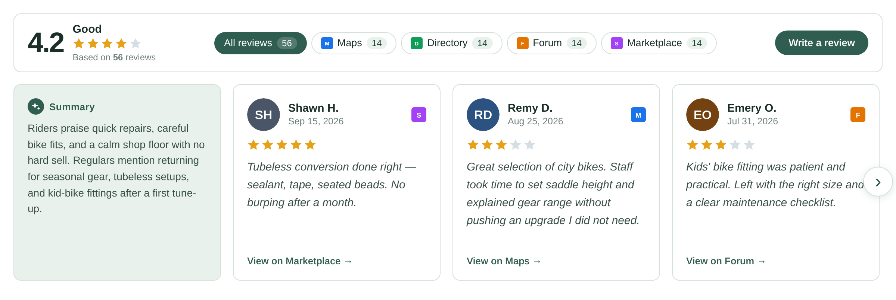

# Reviews widget

## <a href="https://bristweb.github.io/reviews-widget/?source=https://bristweb.github.io/reviews-widget/example/&theme=light" target="_blank" rel="noopener">▶ Live demo (light mode)</a> · <a href="https://bristweb.github.io/reviews-widget/?source=https://bristweb.github.io/reviews-widget/example/&theme=dark" target="_blank" rel="noopener">▶ Live demo (dark mode)</a>

<picture>
  <source media="(prefers-color-scheme: dark)" srcset="docs/example-widget-dark-v2.png" />
  <source media="(prefers-color-scheme: light)" srcset="docs/example-widget-light-v2.png" />
  
</picture>

<a href="https://bristweb.github.io/reviews-widget/embed.html?source=https://bristweb.github.io/reviews-widget/example/" target="_blank" rel="noopener">iframe version</a> · <a href="https://bristweb.github.io/reviews-widget/embed.html?source=https://bristweb.github.io/reviews-widget/example/&constrained=true" target="_blank" rel="noopener">constrained / fixed-height box</a>

```html
<script src="https://bristweb.github.io/reviews-widget/assets/js/reviews-widget.js"
        data-source="https://bristweb.github.io/reviews-widget/example/" defer></script>
```

Paste to try it. For a real site, keep the script `src` and change only `data-source` to your data store. More patterns: [Embed](#embed).

A static, dependency-free reviews widget. Host the files on any static host (GitHub Pages works out of the box). This repo is **code only** — no real reviews. The demo uses a made-up bike shop (“Northwind Cycles”). License is TBD (no LICENSE file yet).

Each site points the widget at its own data with `data-source`. Counts, averages, card order and JSON-LD are computed in the browser.

Product comparison: [COMPARISON.md](COMPARISON.md).

## Contents

1. [Embed](#embed)
2. [Options](#options)
3. [Data format](#data-format)
4. [JSON Schema and validation](#json-schema-and-validation)
5. [Updating data](#updating-data)
6. [Summary card](#summary-card)
7. [Card order](#card-order)
8. [Structured data (JSON-LD)](#structured-data-json-ld)
9. [Header behavior](#header-behavior)
10. [Privacy and presentation](#privacy-and-presentation)
11. [New data repo](#new-data-repo)
12. [Technical details](#technical-details)
13. [Repo layout](#repo-layout)

---

## Embed

Same live demo URLs as at the top of this README. For a real site, keep the script `src` and change only `data-source` (or the iframe `?source=`) to your own data store URL.

### JavaScript (preferred)

```html
<script src="https://bristweb.github.io/reviews-widget/assets/js/reviews-widget.js"
        data-source="https://bristweb.github.io/reviews-widget/example/" defer></script>
```

The widget renders where the tag is. It loads CSS from this repo and `theme/theme.css`, `config.json`, and every `reviews/<year>.json` from `data-source`, in parallel. Options go on the same tag ([list](#options)).

- Sizes itself in the page; no resize script needed for the JS embed.
- Invisible until font and first layout are ready, then fades in once.
- Several tags on one page are fine (even different `data-source`s); each source and the CSS are fetched once.
- Fills the width it is given (up to 1200px) inside page builders that shrink-to-fit their content.
- Classes are prefixed `rw-`; a small reset limits host CSS leakage.

Optional: `data-target="#…"` on the script mounts into that element instead (compatibility when the host is limited or you need a special layout). Prefer the in-place script above. A script in `<head>` with no target renders at the end of `<body>`.

### Google Sites / Similar

If your host gives you a box with limited ability to adjust sizing and responsiveness (Google Sites: *Insert → Embed → Embed code*), turn on **one** toggle:

```html
<script src="https://bristweb.github.io/reviews-widget/assets/js/reviews-widget.js"
        data-source="https://bristweb.github.io/reviews-widget/example/"
        data-constrained="true"></script>
```

`data-constrained="true"` packs the widget into that box: fill the height, arrows inside, nothing drawn outside the box, no hover lift, focus rings drawn inside. It is named “constrained” (not “fixed proportions”) because it follows the box you give it rather than locking an aspect ratio. Stretch the box full width and about **420px** tall; swap `data-source` for your data when you go live. See [Header behavior](#header-behavior) for short heights (tested down to 140px). Extra fitting tweaks (beyond this preset) are CSS classes — see [Options](#options).

### Iframe

```html
<iframe id="reviews-widget"
        src="https://bristweb.github.io/reviews-widget/embed.html?source=https://bristweb.github.io/reviews-widget/example/"
        title="Reviews" loading="lazy" scrolling="no"
        style="width:100%;border:0;height:420px"></iframe>
<script>
  addEventListener('message', function (e) {
    if (e.data && e.data.type === 'reviews-widget-height')
      document.getElementById('reviews-widget').style.height = e.data.height + 'px';
  });
</script>
```

`index.html` and `embed.html` are bare, transparent, `noindex` pages. With no `?source=` they load the bundled fictional demo data the same way.

---

## Options

Each option below is set as `data-<name>` on the script (or target element) and/or as `?<name>=` in the URL. Query wins over `data-*`, which wins over `display` in `config.json`, which wins over the built-in default. Omit an option to keep its default. `source` is special: `?source=` applies only when there is no `data-source`.

| Option | Values | Default |
|---|---|---|
| `source` | Data repo root URL (trailing `/` added if missing). **Required** on real embeds | — |
| `layout` | `carousel` \| `grid` | `display.layout` or `carousel` |
| `platform` | One key from `config.platforms` (filters to that tab). Omit for every platform | all platforms |
| `limit` | Max review cards (`0` = no limit) | `0` |
| `summary` | `off` hides the summary card | shown |
| `theme` | `light` \| `dark` \| `auto` (follow host page theme) | `display.theme` or `auto` |
| `schema` | `off` skips JSON-LD (`data-schema` only; no query param) | injected |
| `constrained` | `true` = tight-box preset: fill height, arrows inside, overflow hidden, no hover lift, focus rings inside | off |

**CSS knobs** (no `data-*`): cards across are responsive by default. Optional classes on `.rw-host` / `.rw-root` — `.rw-clip` / `.rw-overflow-hidden`, `.rw-arrows-inside`, `.rw-nolift`, `.rw-focus-inside`, `.rw-fixed` + `.rw-fixed-host` (usually from `constrained`), `.rw-cards-1`…`4`, and `--rw-pad` for outer padding.

---

## Data format

Plain files at the data root, served over HTTPS with CORS open enough for your pages to fetch them (GitHub Pages does this by default with branch `main`, site root, and `.nojekyll`; any static host works). The widget reads only these paths; other folders (e.g. your own `scripts/`) are never loaded.

```
config.json              business, platforms, display, strings, schema, summary, reviews.years, …
reviews/<year>.json      reviews dated that year (array, newest first)
images/reviewers/        optional local avatars (any path/URL works in records)
icons/                   platform logos
theme/theme.css          @font-face + --rw-* variables
theme/fonts/             optional self-hosted fonts
```

### `config.json`

| Key | Role |
|---|---|
| `business` | `name` (required), optional `website` and extras |
| `platforms` | review platforms in **tab order**: `name`, `icon`, `write_url`, `page_url`, `card_link` (`review`\|`page`), optional `invert_icon_when_active`. Extra fields (scrape URLs, notes, …) are ignored by the widget |
| `default_write_platform` | `write_url` used on the “All” tab |
| `display.*` | layout, snippets, diversity, dates, `theme`, `constrained`, … |
| `schema.*` | JSON-LD on/off, `@type`, `max_reviews`, `extra` |
| `rating_labels`, `strings` | score words and UI copy |
| `summary` | `{ "text", "generated_at" }` for the summary card |
| `reviews.years` | year files to fetch, newest first, e.g. `[2026, 2025]` |

Formal shape: `schemas/config.schema.json` in this repo.

### `reviews/<year>.json`

Array of records for that calendar year, newest first. Store full names, full text, replies, URLs, and platform extras; the widget abbreviates at render time.

```jsonc
{
  "platform": "maps",
  "platform_review_id": "ex-maps-001",
  "reviewer_name": "Avery Quinn",
  "reviewer_profile_url": null,
  "reviewer_image": "images/reviewers/maps-ex-maps-001.svg",
  "reviewer_image_source_url": null,
  "rating": 5,
  "text": "full review text",
  "date": "2026-09-14T18:22:00Z",
  "review_url": "https://example.com/maps/reviews/ex-maps-001",
  "owner_reply": { "text": "…", "date": "2026-09-14T21:00:00Z" },
  "collected_at": "2026-10-01T12:00:00Z"
}
```

`platform` + `platform_review_id` is a **suggested** identity for sync tooling (keep them unique per platform). How a review was collected belongs in your tooling/config, not on the record.

`reviewer_image` may be any working URL or path (absolute, `data:`, or relative to the data root). A local convention like `images/reviewers/<platform>-<id>.<ext>` is only a suggestion for sync scripts — not required.

Formal shape: `schemas/reviews.schema.json` in this repo.

### Theme

`theme/theme.css` sets `--rw-font`, `--rw-ink`, `--rw-accent`, `--rw-star`, `--rw-radius`, `--rw-max-width`, and related variables on `.rw-host`. Font URLs are relative to that file.

**Light / dark:** by default (`data-theme="auto"` or `display.theme: "auto"`) the widget matches the **host page** — `data-theme` / `data-bs-theme` on `html` or `body`, common `dark` / `light` classes, or the page’s CSS `color-scheme`. It only tracks the OS `prefers-color-scheme` when the host itself opts into system (e.g. `color-scheme: light dark`). Force with `data-theme="light"` or `"dark"`. Define dark brand tokens under `.rw-host.rw-dark, .rw-host[data-theme="dark"]` in your theme CSS (see `example/theme/theme.css`).

---

## JSON Schema and validation

| Schema | Validates |
|---|---|
| `schemas/config.schema.json` | `config.json` |
| `schemas/reviews.schema.json` | each `reviews/<year>.json` array |

`scripts/validate.mjs` checks both schemas (via [Ajv](https://ajv.js.org/)) and light filesystem rules: icons exist, relative `reviewer_image` paths resolve, `reviews.years` matches files and is newest-first, dates sit in the right year file, `(platform, platform_review_id)` is unique. Avatar naming is not enforced.

```bash
# from a checkout of this repo (once):
npm ci

# validate any data directory (the bundled example, or your data repo):
node scripts/validate.mjs example
node scripts/validate.mjs /path/to/your-data-repo
```

A data repo can call the reusable workflow on every push:

```yaml
# .github/workflows/validate.yml
name: Validate reviews data
on:
  push:
  workflow_dispatch:
jobs:
  validate:
    uses: bristweb/reviews-widget/.github/workflows/validate.yml@main
```

That workflow checks out this repo, runs `npm ci`, then `node scripts/validate.mjs` on the caller.

---

## Updating data

1. Edit `reviews/<year>.json` (newest first); add the year to `reviews.years` when you add a file.
2. Set `reviewer_image` to any working URL or path (optional local files under `images/reviewers/` are fine).
3. Run `node scripts/validate.mjs <data-dir>`.
4. Publish the data files (`cache: no-cache` on fetches means the widget picks them up quickly after your host updates).

---

## Summary card

Optional first card on “All reviews”: `config.summary` `{ text, generated_at }`. Not linked, not rated, not in JSON-LD, not counted by `data-limit`. Hide with `display.show_summary: false`, `data-summary="off"`, or omit `summary`.

---

## Card order

Deterministic: on “All”, newest first with platform diversity (`display.max_same_platform_run`, `display.diversity_window_days`). Single-platform tabs are newest first. Ties break on `platform:platform_review_id`. Rating-only reviews count in the header but get no card unless `display.show_rating_only_reviews`.

---

## Structured data (JSON-LD)

Built in the browser and injected once per page as `#reviews-widget-schema`. `@type` from `schema.type` (default `LocalBusiness`), `aggregateRating` from 1–5 ratings only, `review` items in card order. Disable with `schema.enabled: false` or `data-schema="off"`. Google often withholds review stars for self-serving business markup; the JSON-LD still describes the entity accurately.

---

## Header behavior

Container queries on the widget’s own width (and height when constrained / `.rw-fixed`):

| Width | Header |
|---|---|
| > 1020px | full score row, named tabs, button |
| ≤ 1020px | tabs → icon + count |
| ≤ 720px | hide “Excellent” / “Based on” |
| ≤ 575px | hide tabs |
| ≤ 360px | button label → short string |

| Height (fixed mode) | |
|---|---|
| ≤ 460px | compact header |
| ≤ 240px | slim header; cards drop date / “View on”; snippets clamp |

Carousel: 4 / 3 / 2 / 1 cards by width breakpoints.

---

## Privacy and presentation

- **Storage:** full names, text, replies, URLs, extras in the public data files.
- **Presentation:** first name + last initial; ~160-character snippets; card links back to the platform.

---

## New data repo

1. Create a repo (or folder) for the data; publish it on any static host. If you use GitHub Pages: branch `main`, site root, and keep `.nojekyll`. Optionally add a validate workflow (above).
2. Add `config.json`, `icons/`, `theme/`, empty `reviews/` + `images/reviewers/`, `"reviews": { "years": [] }`.
3. Add records and avatars; validate; push.
4. Embed with `data-source` pointing at that published data URL.

---

## Technical details

- Loads `config.json`, then all year files in parallel; injects CSS if missing.
- Without `data-source` / `?source=`, shows the unavailable message.
- Fixed-height mode: host height 100% or viewport remainder; card text scrolls without blocking horizontal swipe.
- Icons: data-repo SVG, then Simple Icons CDN fallback.
- Local preview: serve this repo (and your data) from any static origin with CORS (`Access-Control-Allow-Origin: *`) and open `index.html` or point `data-source` at a local URL.

---

## Repo layout

```
assets/js/reviews-widget.js   widget
assets/css/reviews-widget.css layout (reads --rw-* from the data theme)
index.html, embed.html        demos (default data-source: example/)
example/                      fictional sample data
schemas/*.schema.json         config + reviews JSON Schema
scripts/validate.mjs          Ajv + filesystem checks
docs/example-widget-light-v2.png  README screenshot (light)
docs/example-widget-dark-v2.png   README screenshot (dark, via <picture>)
COMPARISON.md                 named product comparison
.github/workflows/            check (this repo) + reusable validate
```

Review text belongs to its authors; platform marks belong to their owners.
